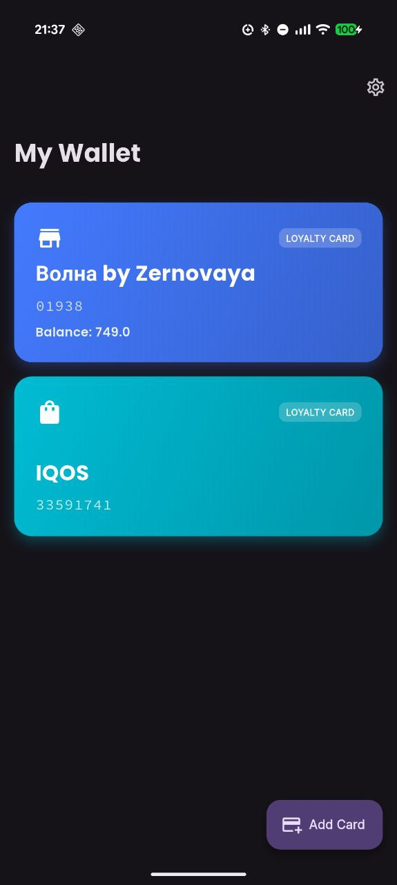
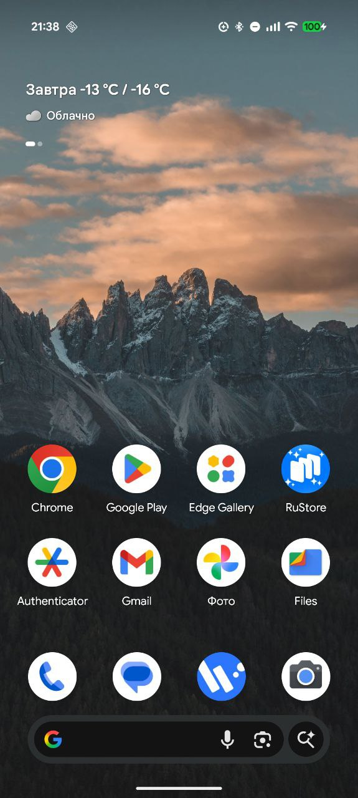

# MyWallet

A Flutter loyalty card wallet that supports Apple Wallet (`.pkpass`) files.

## Features

- **Import `.pkpass` files**: Easily add your loyalty cards from local files.
- **Balance Tracking**: Automatically parses and displays loyalty points/balance from card headers.
- **Dynamic Updates**: Supports standard Apple PassKit web services to refresh balance via pull-to-refresh.
- **QR Code Support**: Displays high-quality QR codes for scanning at checkouts.
- **Offline First**: All cards are stored locally on your device.

## Getting Started

1. Clone the repository.
2. Run `flutter pub get`.
3. Connect your device and run `flutter run`.

## Screenshots

  
  
  
  

